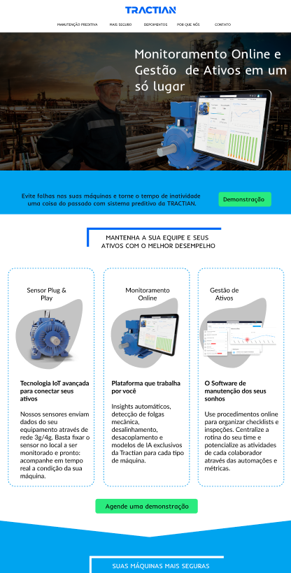

:mortar_board: Meus Projetos..

# traction-page

[Technologies](#Technologies-traction-page)  |  [How To Use](#how-to-use-traction-page)  |  [My Purpose](#my-purpose-traction-page) 
</br></br>


========================= ## =========================
<a id="Technologies-traction-page"></a>

### < Technologies />

:arrow_right:  This project was developed with the following technologies:

- [Reactjs](https://reactjs.org/)
- [react-icons](https://react-icons.github.io/react-icons/)
- [Styled-Components](https://styled-components.com/)
- [Typescript](https://www.typescriptlang.org/)


========================= ## =========================
<a id="how-to-use-traction-page"></a>

### < How To Use />
:hash: To clone and run this application, you will need Git, Node.js v14.15 or higher installed on your computer. From your command line:

```
# Clone this repository
$ git clone git@github.com:Marcelllombm/traction-page.git

# enter the folder
$ cd traction-page

# Install dependencies
$ npm install or yarn

# Run the app
$ npm start or yarn start
```
========================= ## =========================
<a id="my-purpose-traction-page"></a>

### < My Purpose />

:dart: The objectives of this project are: Build a landing page from the Tractian homepage
========================= ## =========================
